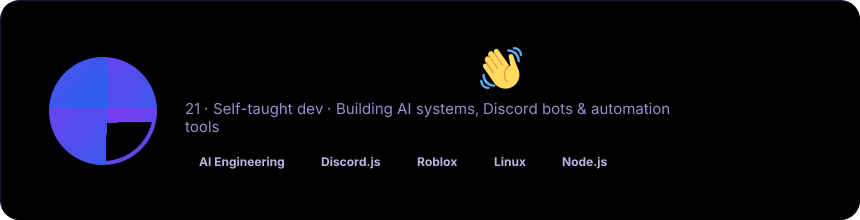
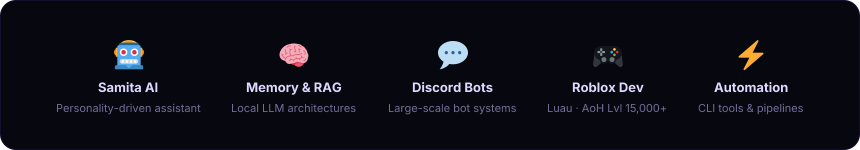
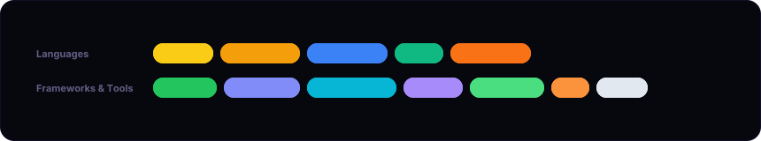
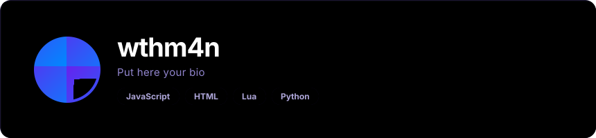

<<<<<<< HEAD

 

***

## 🚀 Currently Building

* 🤖 **Samita** — A personality-driven AI assistant with long-term memory
* 🧠 **RAG Systems** — Semantic search + vector database pipelines
* 🎙️ **Voice AI** — Real-time voice interaction systems
* ⚡ **Automation Tools** — GitHub pipelines, file processing, CLI apps

***

## 🛠 Tech Stack

***

## 💡 What Makes Me Different

I didn't follow a traditional CS path. My experience comes from **running communities**, **shipping real products**, and **reverse engineering systems** until they made sense.

Strongest at: Rapid prototyping · System architecture · Automation · Community-driven dev

> *Building things, breaking things, and learning from both.*

***

## 📊 GitHub Stats

***

## 🌐 Find Me

***

*𝔭𝔬𝔴𝔢𝔯𝔢𝔡 𝔟𝔶 [𝔯𝔢𝔞𝔡𝔪𝔢-𝔞𝔲𝔯𝔞](https://github.com/collectioneur/readme-aura)*

=======

>>>>>>> 7dcb120a45ab9a83ce126a5968c845a5527bdbd2
